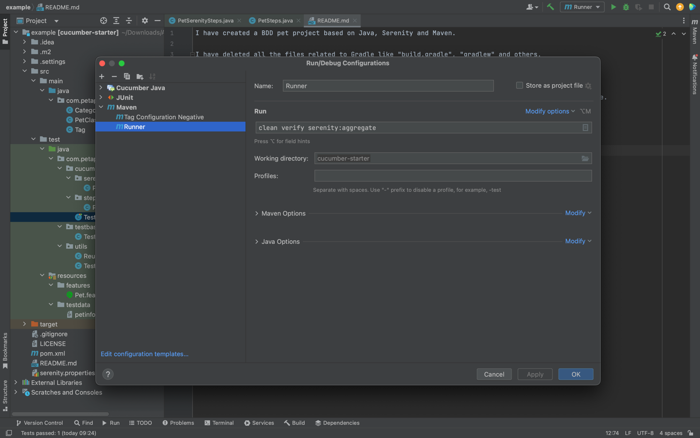
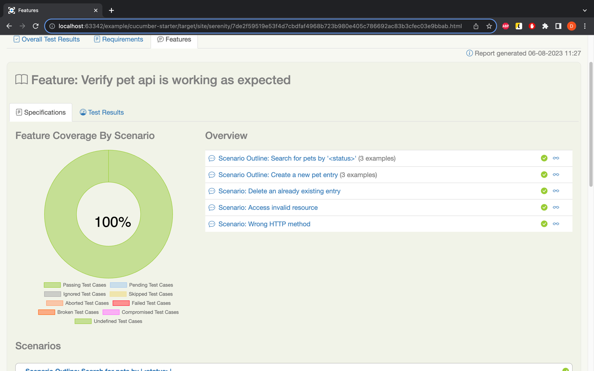

I have created a BDD pet project based on Java, Serenity and Maven.

I have deleted all the files related to Gradle like "build.gradle", "gradlew" and others.
I have configured the pom.xml file to work with the latest versions of serenity.
I have created a mini structure. Like java.com.petapp.model where I store DTO

PetSerenitySteps.class I store the logic of a couple of methods which I use in the stepdefinition package. 
TestBase is where I initialize the Base Endpoint.
ReusableSpecification is for those specification like Content-Type which I need to verify in my tests. 
TestRunner is the class which allows to trigger the scenarios from feature file.

In order to trigger the tests, I run them using a specific configuration: Goal "clean verify serenity:aggregate" 
which allow to run tests and get the report.

Unfortunately I could not integrate it with Gitlab

